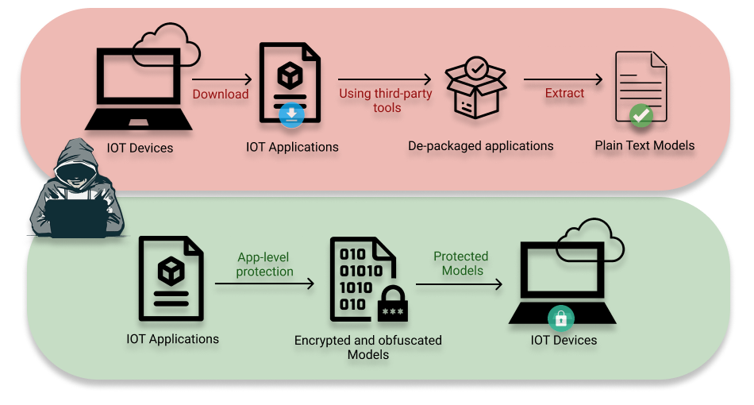

# Graduate

## Reading Tutorials

### Session I: App-level ML Security

<!--  -->
<dl><dt>Attacks:</dt></dl>

* A First Look at Deep Learning Apps on Smartphones [[PDF](https://arxiv.org/pdf/1812.05448.pdf)]
* Smart App Attack: Hacking Deep Learning Models in Android Apps [[PDF](https://arxiv.org/pdf/2204.11075.pdf)]

<dl><dt>Defenses:</dt></dl>

* Securing Neural Networks with Knapsack Optimization [[PDF](https://arxiv.org/abs/2304.10442)]



<dl><dt>Questions:</dt></dl>

* When do app-level ML attacks happen?
* What are the methodologies for app-level ML protection?

### Session II: Device-level ML Security

<dl><dt>Attacks:</dt></dl>

<dl><dt>Defenses:</dt></dl>



<dl><dt>Questions:</dt></dl>

### Session III: Runtime ML Security

<dl><dt>Attacks:</dt></dl>

<dl><dt>Defenses:</dt></dl>



<dl><dt>Questions:</dt></dl>

### Session IV: Model-level ML Security

<dl><dt>Attacks:</dt></dl>

<dl><dt>Defenses:</dt></dl>



<dl><dt>Questions:</dt></dl>

<!-- ### Session III: Model Stealing Attacks -->

[back](./)